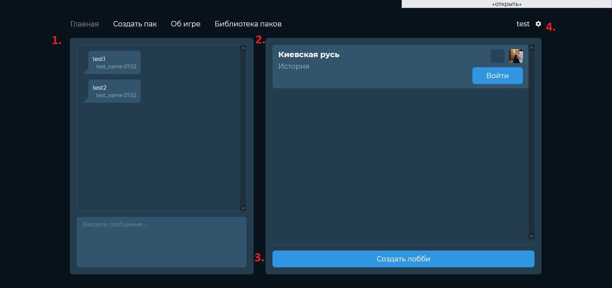
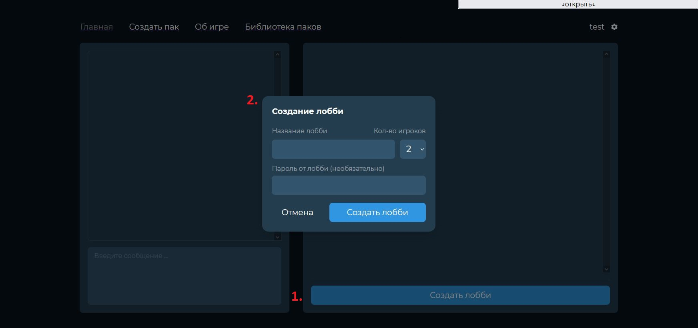
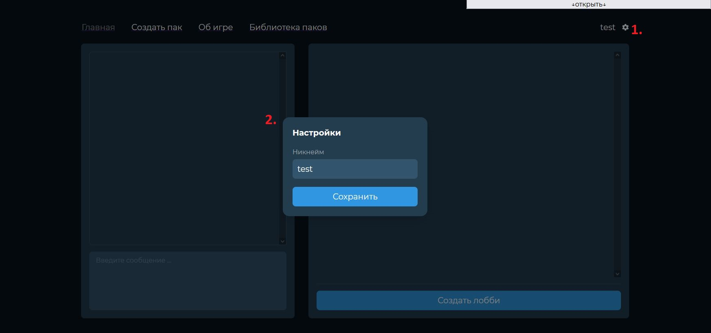
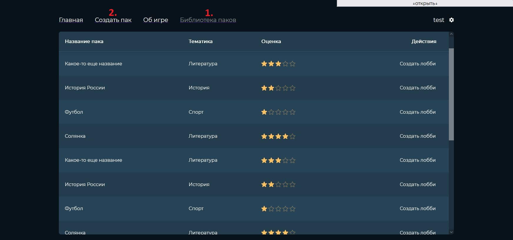
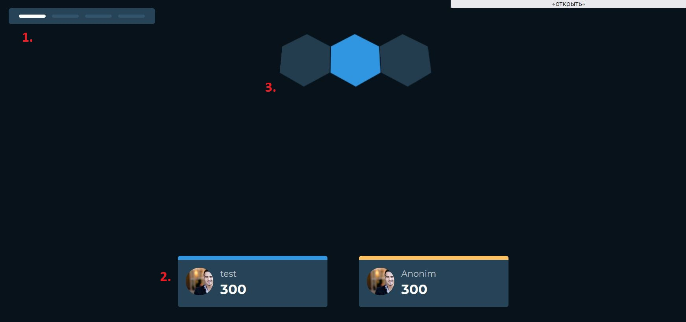
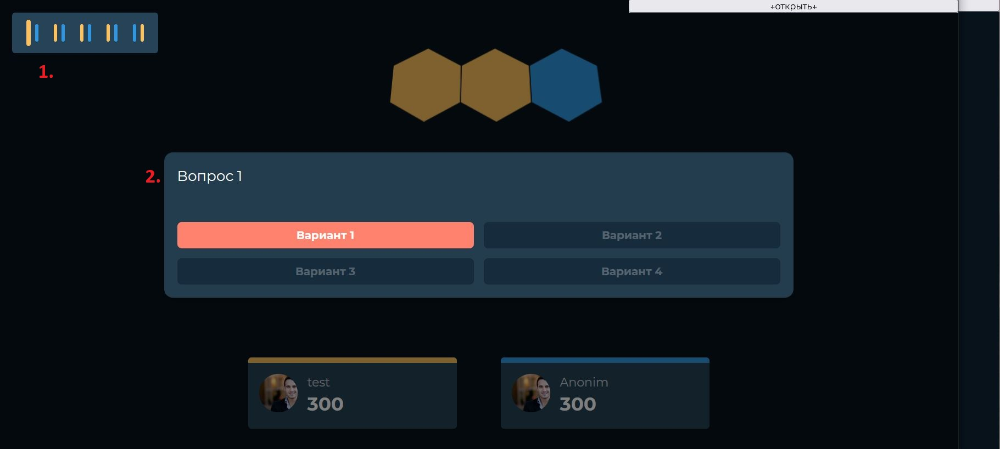
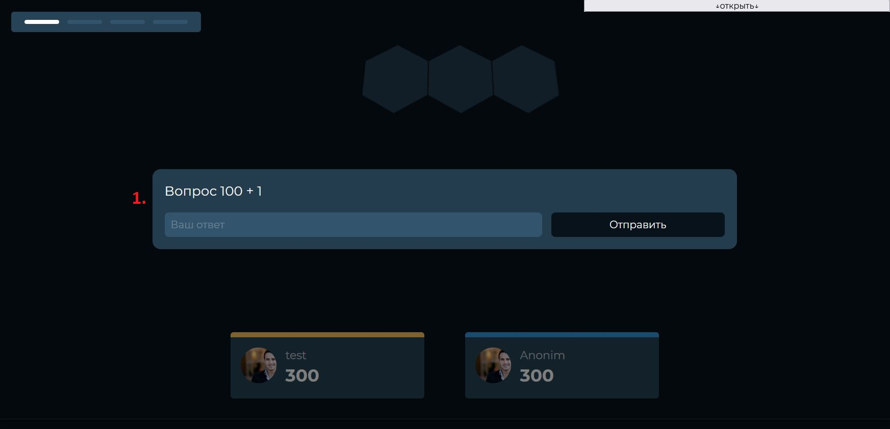
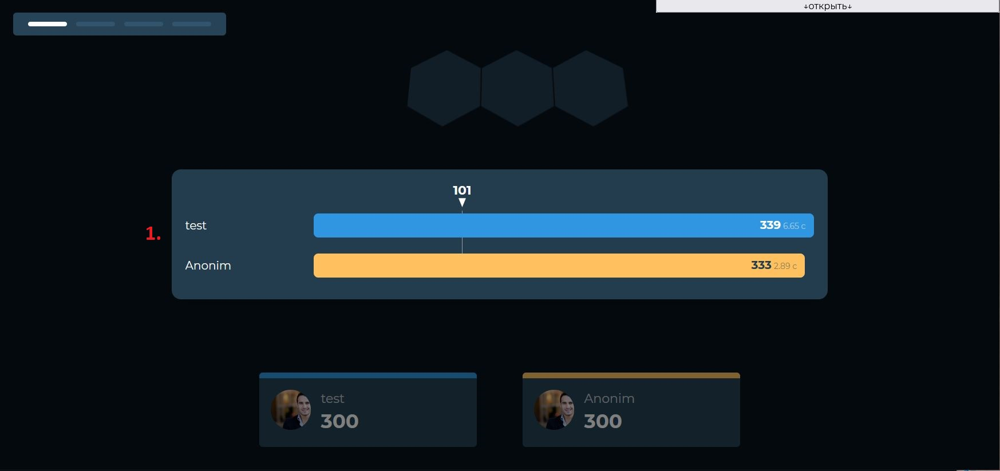

# quiz

Онлайн викторина в игровом стиле

1. Аналог https://ru.wikipedia.org/wiki/Conquiztador

2. Аналог https://conquiztador.online/

## Проект

Статус - <b>In Progress</b>

### Запуск приложения

```
docker-compose up
```

http://localhost:3000/

### Запуск игры

> Игра рассчитана на текущий момент на 2х игроков, чтобы эмулировать второго игрока
> нужно открыть отдельную вкладку в инкогнито

> Первый игрок должен создать комнату для игры зайдя на главную страницу
> после нажав кнопку "Создать лобби" введя любой текст в названии комнаты после
> нажав кнопку "Создать". Второй игрок присоединяется по прямой ссылке комнаты первого игрока,
> как только второй игрок присоединяется запускается игра.

### План разработки

| Функционал                           | Frontend                                                                                                                                                          | Backend                                                                                                                                                  |
|--------------------------------------|-------------------------------------------------------------------------------------------------------------------------------------------------------------------|----------------------------------------------------------------------------------------------------------------------------------------------------------|
| Главная страница                     | 1. ✅ Чат<br/> 2. ️️✅ Список комнат<br/> 3. ️✅ Создание комнаты<br/> 4. ✅ Настройки игрока                                      | 1. 🤔 Чат<br/> 2. ️️🤔 Список комнат<br/> 3. ️🤔 Создание комнаты<br/>                                                                                   | 
| Страница библиотеки вопросов | 1. ⬜️ Фильтр по тематике<br/>2. ⬜️ Пагинация                                                                                                                      | 1. ⬜️ API                                                                                                                                                |
| Игровая комната                      | 1. ✅ Вопрос с числовым диапазоном<br/> 2. ✅ Вопрос с вариантами<br/> 3. ✅ Отрисовка карты<br/> 4. ✅ Нападение и захват клетки<br/> 5. ⬜️ Статистика сыгранной игры | 1. ✅ Вопрос с числовым диапазоном<br/> 2. ✅ Вопрос с вариантами<br/> 3. ✅ Карта<br/> 4. 🤔 Нападение и захват клетки<br/> 5. ⬜️ Статистика сыгранной игры |

✅ - реализовано 🤔 - реализовано частично ⬜️ - не реализовано

## Дизайн

### Главная страница





### Страница библиотеки вопросов




### Игровая комната




